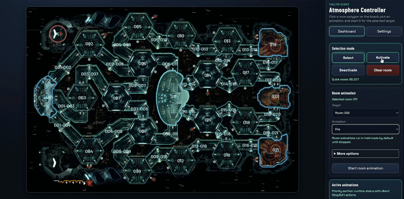
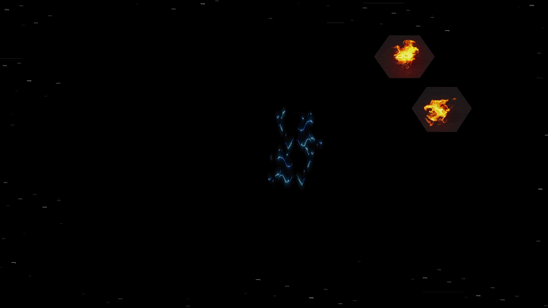
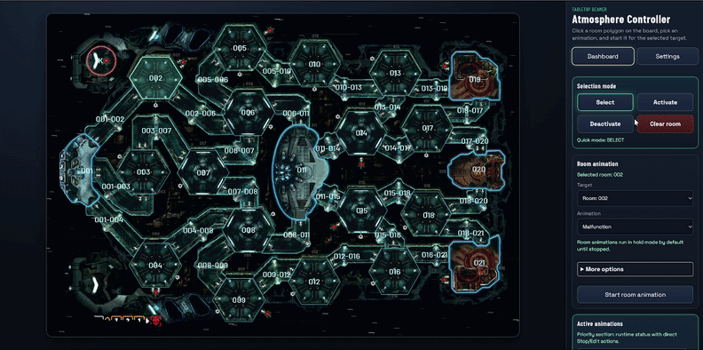

# TABLETOP BEAMER | Atmosphere Controller

A tabletop projector overlay controller designed to enhance board games with immersive animations.

> NOTE: This is more of an hobby project build for myself than a stable piece of software. Expect bugs 🕷️. AI was heavily used here.


<p align="center">
<table>
<tr>
  <td><video src="https://github.com/user-attachments/assets/2dbe0f3f-5305-45ef-9895-f87d07323829"></video></td>
  <td><video src="https://github.com/user-attachments/assets/f9b21f27-8330-4f6a-a1cb-ea3e045b27f1"></video></td>
</tr>
</table>

</p>

## Features

- Quickly start and stop room animations  


- Optimized for mobile browser control

- Dedicated output path for projector animation rendering  


- Fine-grained animation control (speed, opacity, etc.)

- Built-in animations:
  - [Coded] Space travel (outside view)
  - [MP4] Sandstorm (outside view)
  - [Coded] Alarm
  - [Coded] Scanning
  - [GIF] Slime
  - [GIF] Malfunction

- Support for custom animations (GIF or MP4)

- Create, edit, and manage custom areas:
  - **Rooms** (indoor areas)
  - **Play areas** (for “outside” effects like space)  


- Group multiple Rooms/Areas to "Clusters", so you can start an animation for the whole cluster.

- Set up custom sounds to specific animations.

- Preshipped with **OG Nemesis** (both boards) and **Nemesis Lockdown** (both boards).

- **Align mode** — a full in-browser projection-mapping workflow to match the projected image to the physical board. Includes:
  - Freely draggable grid with intersections, line handles, and whole-grid pan
  - Proportional scaling when outer edges are moved
  - Add/remove grid lines on the fly via right-click context menu (deformation is preserved)
  - Triangulated mesh warp — SVG room outlines and canvas animations stay perfectly in sync
  - Rotate the whole projection from any of the 4 corner handles
  - **Undo** with `Ctrl+Z` / `Cmd+Z`
  - Persisted per-client in `localStorage`
  - **Server-side profiles per board** — save, load, and delete named calibrations via the right-click menu

<!-- TODO: screenshot / short GIF of align mode in action here -->


## Requirements

- **Short-throw, ceiling-mounted projector**  
  Ensure the projection fully covers your table.

  Example setup (Amazon Germany):
  - Projector: BenQ TH671ST  
  - Ceiling Mount: ONKRON Projector Ceiling Holder  
  - Raspberry Pi: Raspberry Pi 5 (8GB Starter Kit)

  > It's fine if the image is larger than the table — the in-browser **Align Mode** can shrink and warp the projection to match the board. If you prefer the projector itself to only cover the table (so no light spills onto surrounding chairs/walls), `xrandr` is still supported as an optional hardware-level step — see [Optional: xrandr](#optional-xrandr-hardware-level-cropping).

- **Raspberry Pi** (or similar Linux-based mini PC) connected to the projector

- **Computer** running the server

- **Mobile phone** with a browser for controlling animations


## Setup

### PC / Server

Run the backend server on any machine reachable from your Pi and your phone:

```bash
sudo apt update
sudo apt install -y nodejs npm

git clone https://github.com/McFredward/tt-beamer
cd tt-beamer

node server.mjs --host 0.0.0.0 --port 4173
```

Windows users:  
Follow this guide to install Node.js:  
https://learn.microsoft.com/windows/dev-environment/javascript/nodejs-on-windows

### Raspberry Pi (Projector Device)

On the Pi, open a browser in kiosk/fullscreen mode pointing at the server's output view:

```
http://<SERVER-IP>:4173/output
```

That's all that's strictly required — the in-browser Align Mode handles everything else.

## Getting Started

1. **Start the server** on your PC / server machine:
   ```bash
   node server.mjs --host 0.0.0.0 --port 4173
   ```

2. **Open the control interface** on your phone:
   ```
   http://<SERVER-IP>:4173
   ```

3. **Open the output view** on the Pi (or whichever device drives the projector):
   ```
   http://<SERVER-IP>:4173/output
   ```

4. **Align the projection**. On the dashboard press the **Align Mode** button (the prominent toggle near the top). A calibration grid appears on the output view. Drag it until the room outlines sit exactly on the board:

   - **Intersection handles (teal circles)** — drag to move that single point freely.
   - **Line handles (↕ / ↔ badges)** — drag a whole row/column along one axis.
   - **Outer edges** — dragging an outer edge or corner proportionally scales all inner points, so the whole image resizes with it.
   - **Empty area** — left-click and drag to pan the whole grid.
   - **Rotate handles (orange ↻ badges at the 4 corners)** — drag to rotate the entire grid around its centroid.
   - **Right-click** anywhere on the grid for a context menu:
     - **Add horizontal/vertical line** — inserts a new control line at the click position (existing deformation is preserved).
     - **Remove this line** — removes the line you right-clicked near.
     - **Save profile…** — persists the current calibration to the server under a name you choose (scoped to the current board).
     - **Load profile…** — pick from previously saved profiles for this board.
     - **Delete profile…** — remove a saved profile.
     - **Reset all** — restore default 5×5 grid.
   - **`Ctrl+Z` / `Cmd+Z`** — undo the last action. Works for all grid operations.
   - **`ESC`** — reset the grid to its default.
   - Arrow keys nudge the currently selected handle (hold `Shift` for larger steps).

   Calibration is persisted per client in `localStorage`, and **named profiles are stored server-side per board** so you can switch boards and re-apply a previous calibration with two clicks.

   <!-- TODO: screenshots of the align grid, the context menu, and the rotate handles -->

5. **You're ready** — start controlling animations and enjoy your game!

## Optional: xrandr (hardware-level cropping)

The in-browser Align Mode handles most projection alignment just fine. The only thing it can't do is prevent light from spilling past the edges of your table — it can shrink the _content_, but the projector will still emit light everywhere. If that bothers you (e.g., it lights up nearby walls or chairs), you can additionally use `xrandr` to crop and transform the output signal at the X server level.

This is only supported on Raspberry Pi OS when running the X11 session (not Wayland). Switch the session:

```bash
sudo cp /etc/lightdm/lightdm.conf /etc/lightdm/lightdm.conf.bak
sudo sed -i 's/user-session=.*/user-session=rpd-x/' /etc/lightdm/lightdm.conf
sudo sed -i 's/autologin-session=.*/autologin-session=rpd-x/' /etc/lightdm/lightdm.conf
sudo systemctl restart lightdm
```

Install the bundled mapper helper:

```bash
sudo apt update
sudo apt install -y python3 python3-venv

cd ~
git clone https://github.com/McFredward/tt-beamer
cd tt-beamer/scripts

python3 -m venv venv
./venv/bin/pip install pygame numpy
```

Run the mapping tool:

```bash
~/tt-beamer/scripts/venv/bin/python map.py
```

This tool lets you:

- Adjust a rectangle to match your table or board
- Drag vertices with the mouse
- Fine-tune using arrow keys
- Press **Enter** to apply the transformation
- Press **ESC** to exit

After `xrandr` has cropped the projector output, you can still fine-tune room outlines from the phone using the in-browser **Align Mode** described above.

---

## Known Issues

- MP4 playback can be demanding on the Raspberry Pi  
  → Prefer GIF animations for better performance
- Sound issues global Animations which are not looped (if you wish to have sound for those Animations, for now check "loop until stopped" and stop them manually)
- Sometimes some GIF-Animations are played on the pi but not on the phone.

## Future plans

- Add more of my favourite Board games like `Frostpunk the Board game`, `Twilight Imperium IV`, `This War of Mine`, ...
- **Train Computer-Vision Models for local inference for some board games for automatic animations instead of pure manual control.**

## Useful stuff
### Looping Videos (FFmpeg)

I used this command to create looped versions of video animations which are not looped. Does not work with everything, but so far my best attempt without using AI models to interpolate or animate.

```bash
ffmpeg -i input.mp4 -filter_complex "
[0:v]split=2[vA][vB];
[0:a]asplit=2[aA][aB];
[vA]trim=0:duration/2,setpts=PTS-STARTPTS[v1];
[vB]trim=start=duration/2,setpts=PTS-STARTPTS[v2];
[aA]atrim=0:duration/2,asetpts=PTS-STARTPTS[a1];
[aB]atrim=start=duration/2,asetpts=PTS-STARTPTS[a2];
[v2][v1]xfade=transition=fade:duration=5:offset=(duration/2-5)[v];
[a2][a1]acrossfade=d=5[a]
" -map "[v]" -map "[a]" -c:v libx264 -crf 18 -preset slow -pix_fmt yuv420p -movflags +faststart output.mp4
```

---

If you have any suggestions, feel free to open an Issue. Or contact me (McFredward) in via Discord.
