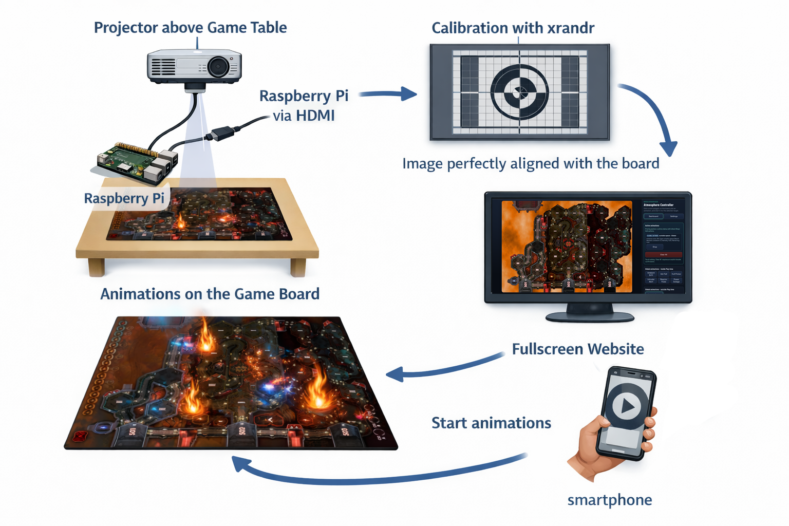

# tt-beamer

TableTop beamer overlay controller with shared live sync, final output rendering, and server-backed defaults.

<p align="center">
  
</p>

## Set-Up

This project uses `xrandr` for transforming the image to perfectly fit to the corresponding table. To be able to use `xrandr` on RasberryPiOS, you need to switch from LightDM to X11.

```bash
sudo cp /etc/lightdm/lightdm.conf /etc/lightdm/lightdm.conf.bak # backup
sudo sed -i 's/user-session=.*/user-session=rpd-x/' /etc/lightdm/lightdm.conf
sudo sed -i 's/autologin-session=.*/autologin-session=rpd-x/' /etc/lightdm/lightdm.conf
sudo systemctl restart lightdm # or full restart
```

## Start

1. Start API + frontend:
   - `node server.mjs`
2. Open control UI:
   - `http://localhost:4173`
3. Optional final output (FX only):
   - `http://localhost:4173/output/final`

## Save flow

- `Save (local -> global defaults)` sends `POST /api/global-defaults`.
- Requires the Node API server (`node server.mjs`).
- Static hosting only (for example `python3 -m http.server`) cannot save defaults.

## Board catalog and import

- Catalog endpoint: `GET /api/boards`
- Import endpoint: `POST /api/boards/import`
- Imported boards are persisted in:
  - `config/boards/imported/*.json`
- Built-in boards are loaded from:
  - `config/zones/*.json`

### Import format (`tt-beamer.board-definition.v1`)

```json
{
  "board": {
    "boardId": "my-board-id",
    "metadata": {
      "name": "My Board",
      "imageSrc": "/resources/my-board.png"
    },
    "roomCatalog": [
      { "id": "r-1", "name": "Bridge", "x": 0.2, "y": 0.3, "radius": 0.06 }
    ],
    "roomClusters": [
      { "clusterId": "cluster-top", "name": "Top Side", "roomIds": ["r-1"] }
    ]
  }
}
```

## Notes

- Room clicks always select a single room.
- Cluster execution is available through the room target dropdown.
- Operator-facing copy must be English-only in Phase 6 flows (Control, Settings, Final flow, status, and errors).
- Language-sweep verification artifact:
  - `.planning/phases/phase-06/P6-HF1-LANGUAGE-SWEEP.md`

## Loop videos

```bash
ffmpeg -i input.mp4 -filter_complex "
[0:v]split=2[vA][vB];
[0:a]asplit=2[aA][aB];
[vA]trim=0:duration/2,setpts=PTS-STARTPTS[v1];
[vB]trim=start=duration/2,setpts=PTS-STARTPTS[v2];
[aA]atrim=0:duration/2,asetpts=PTS-STARTPTS[a1];
[aB]atrim=start=duration/2,asetpts=PTS-STARTPTS[a2];
[v2][v1]xfade=transition=fade:duration=5:offset=(duration/2-5)[v];
[a2][a1]acrossfade=d=5[a]
" -map "[v]" -map "[a]" -c:v libx264 -crf 18 -preset slow -pix_fmt yuv420p -movflags +faststart output.mp4

ffmpeg -i input.mp4 -filter_complex "
[0:v]trim=0:10,setpts=PTS-STARTPTS[v1];
[0:v]trim=10:20,setpts=PTS-STARTPTS[v2];
[0:a]atrim=0:10,asetpts=PTS-STARTPTS[a1];
[0:a]atrim=10:20,asetpts=PTS-STARTPTS[a2];
[v2][v1]xfade=transition=fade:duration=5:offset=5[v];
[a2][a1]acrossfade=d=5[a]
" -map "[v]" -map "[a]" -c:v libx264 -crf 18 -preset slow output.mp4
```