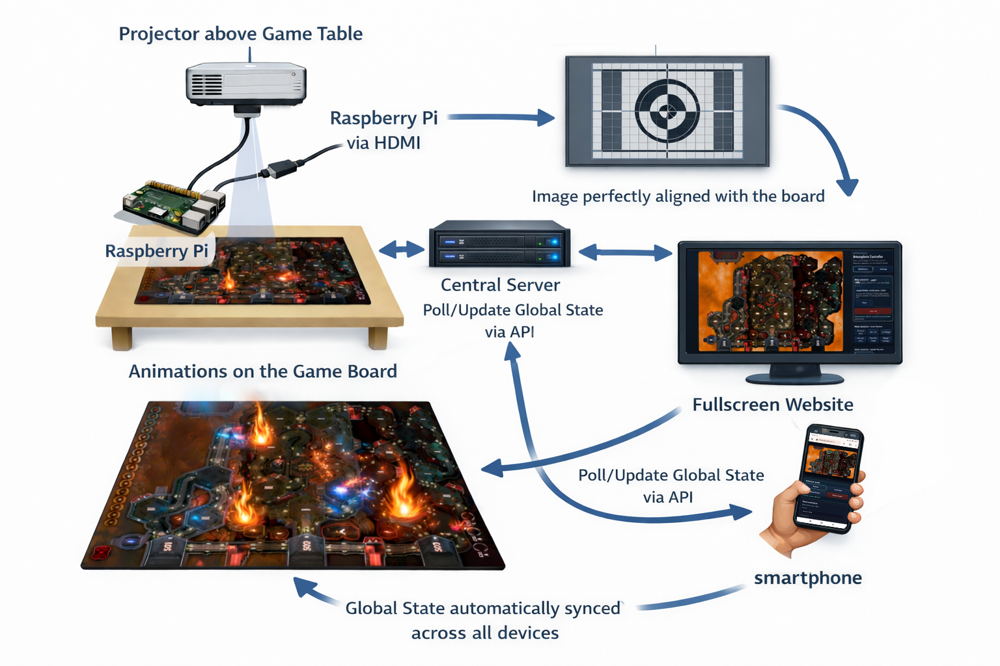
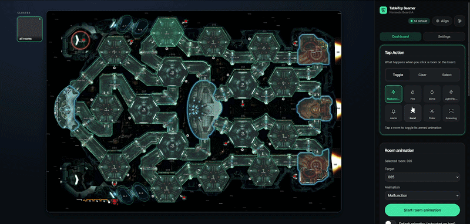
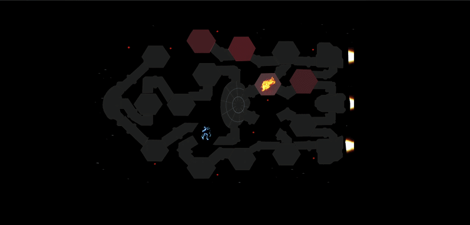
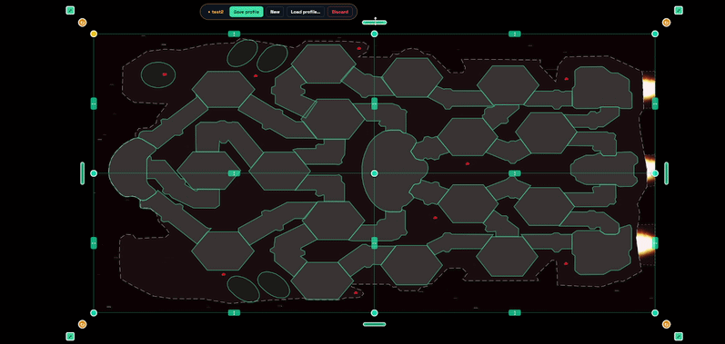
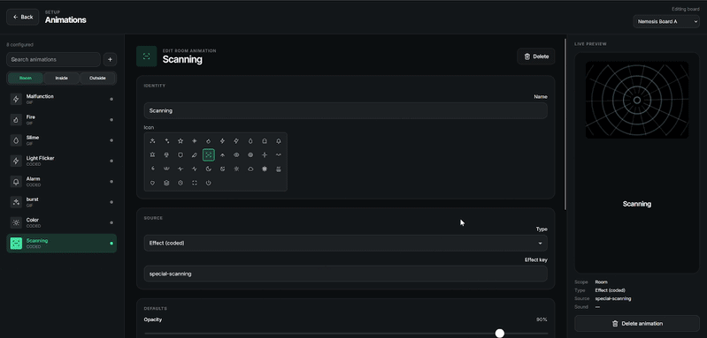
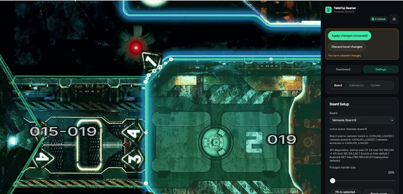

<div align="center">


# TableTop Beamer

**Atmospheric projection mapping for tabletop board games.**

A short-throw ceiling projector beams animations onto your board — alarms, lights,
intruders, space backdrops — and you trigger them from your phone, room by
room, in real time.

[](LICENCE)
[](#requirements)
[](https://nodejs.org/)
[](#project-status)

<br>



</div>

> [!NOTE]
> Hobby project, not a perfectly polished product. AI was
> used heavily during development. Bugs exist 🕷️ — suggestions and PRs welcome.

---

## What is it?

TableTop Beamer turns a ceiling-mounted short-throw projector into an
interactive atmosphere layer for board games. You define <b>rooms</b>
(polygons painted onto the board), assign <b>animations</b> (alarms,
fires, scanners, intruders, MP4 loops…), group rooms into <b>clusters</b>,
and trigger everything from your phone during play.

<p align="center">
  
</p>

Two browsers run side-by-side:

- **Control dashboard** (`/`) — on your phone or tablet. Tap rooms to fire
  effects, manage what's running, alter speed/opacity/sound on the fly.
  <div align="center">
  
  </div>
- **Output view** (`/output`) — fullscreen on a Raspberry Pi connected to the
  projector. No UI, just the rendered animations warped to fit your physical
  board.
  <div align="center">
  
  </div>

Both browsers stay in sync through the server: a change made on one client
appears on every other within a frame. Multiple controllers can be connected
at once.

---

## Highlights

- 📦 **Pre-shipped boards.** `Nemesis` (both base-game boards) and `Nemesis
  Lockdown` (both boards) are included with hand-crafted polygons and a starter
  animation library.
- 🎯 **In-browser projection mapping.** A WebGL-accelerated mesh-warp grid you
  drag, rotate, and scale until the projection sits perfectly on the physical
  board. Profiles are saved per-board on the server.
  <div align="center">
  
  </div>
- 📱 **Mobile-first control UI.** Designed for one-thumb operation during a game.
- 🪐 **Animation editor.** Built-in coded effects, plus your own GIF / MP4 /
  audio uploads. Per-scope library (Room / Inside / Outside) with drag-and-drop reorder.
  <div align="center">
  
  </div>
- 🧩 **Rooms, play areas, clusters.** Paint any polygonal region. Group rooms
  so one tap fires across many at once.
  <div align="center">
  
  </div>
- 🔊 **Per-animation sounds** with global master volume.
- 💾 **Self-contained board packages.** Export everything as a single `.zip`;
  re-import on another machine, nothing else required.
- 🥧 **Server-Side-Rendering.** The output path is build and optimized for a "weak" thin client like a Raspberry-Pi.

---

## Requirements

| | |
|---|---|
| 🎥 **Projector** | Short-throw, DLP, ceiling-mounted |
| 🖥️ **Output device** | Raspberry Pi 4/5 (or any Linux mini PC) connected to the projector |
| 🌐 **Server** | Any 64-bit Linux (Debian/Ubuntu) or Windows 10/11 machine on the same LAN. Node.js auto-installed by the launcher. |
| 📱 **Controller** | Phone / tablet / desktop with a modern browser |

**Reference setup** I use: BenQ TH671ST projector, ONKRON ceiling holder,
Raspberry Pi 5 (8 GB).

---

## Quick start

```bash
git clone https://github.com/McFredward/TableTop-Beamer
cd TableTop-Beamer
./start.sh             # Linux
# Windows: double-click start.bat in File Explorer
```

The launcher downloads a portable Node 22, installs system deps (with one
`sudo`/UAC prompt), runs `npm ci`, boots the server, and opens the dashboard.

The console prints the LAN URLs to open from your phone + Pi:

```
TT-Beamer is running.
  Dashboard (open on phone/tablet):  http://192.168.x.x:4173/
  Output view (open on the Pi):      http://192.168.x.x:4173/output/
```

Full walkthrough, manual setup, and troubleshooting: [**docs/INSTALL.md**](docs/INSTALL.md).

---

## Documentation

| | |
|---|---|
| 📘 [**INSTALL.md**](docs/INSTALL.md) | Click-and-run launcher, manual / dev setup, troubleshooting |
| 📗 [**USAGE.md**](docs/USAGE.md) | Aligning the projection, dashboard + settings reference, animation editor, boards, export/import, data layout |
| 🛠️ [**UTILITIES.md**](docs/UTILITIES.md) | Optional helper scripts — hardware-level `xrandr` cropping, seamless video looping |

---

## Performance tips

- **Keep `/output/` in the foreground** on the projector Pi. Chromium throttles
  background tabs, which causes spurious "lost connection" cycles. Fullscreen-kiosk
  mode on the projector display avoids this entirely.
- **Default stream settings** (H.264, 1080p, 30 fps source / 60 fps stream
  cap, 16 Mbit/s) are tuned for a Pi 5 + a 1080p projector on a quiet LAN.
  In Settings → System (Server Side Rendering) you can switch the codec
  (H.264 / VP9), pick a content-hint (detail / motion / auto), and step
  the bitrate up to Maximum (30 Mbit) or down to Low (3 Mbit) if you see
  jitter.

---

## Known issues

- Mediasoup ships **no prebuilt worker for ARM64 Windows** — the click-and-run
  launcher bails fast on ARM64 Windows with a clear message. AMD64
  (Intel/AMD 64-bit) is fully supported.
- The board of `Nemesis Lockdown B` is too big - you can compress the too large margins in the align mode to fit the board.

---

## Roadmap

- More pre-shipped boards: `Frostpunk: The Board Game`, `Twilight Imperium IV`,
  `This War of Mine`, …
- **Computer-vision-driven automation** — train local CV models that watch the
  board state and trigger animations automatically (no manual taps).
- Per-cluster live editor (long-press a cluster pad to open it).

---
---

If you want to fork or extend, the full architecture + decision history is
documented under `.planning/phases/`. Open a
[GitHub issue](https://github.com/McFredward/TableTop-Beamer/issues) for
suggestions, or reach me as **McFredward** on Discord.

[GNU General Public License v3.0](LICENCE)
